<div align="center">


### The whole world, live, on one map.

Conflicts, flights, ships, markets and breaking news fused onto a single real-time WebGL map,<br>
with AI briefs, country risk scoring and six purpose-built intelligence dashboards.


<a href="./LICENSE"></a>

</div>

<br>

<p align="center">
  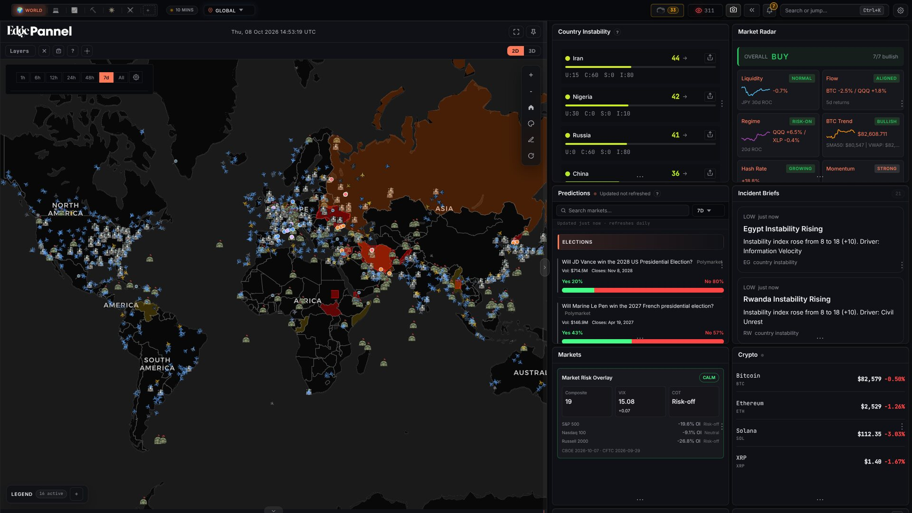
</p>

<p align="center"><sub>The World dashboard: 16 live layers (flights, bases, conflict zones, sanctions, outages, weather), the Country Instability Index, a 7-signal Market Radar, Polymarket odds and auto-generated incident briefs, all updating in real time.</sub></p>

---

## At a glance

<table>
  <tr>
    <td align="center" width="33%"><h2>6</h2><sub>dashboards from<br>one codebase</sub></td>
    <td align="center" width="33%"><h2>64</h2><sub>toggleable map layers<br>in 12 categories</sub></td>
    <td align="center" width="33%"><h2>570+</h2><sub>curated live<br>news feeds</sub></td>
  </tr>
  <tr>
    <td align="center"><h2>70+</h2><sub>live data<br>panels</sub></td>
    <td align="center"><h2>28</h2><sub>typed API services<br>(168 proto files)</sub></td>
    <td align="center"><h2>21</h2><sub>languages,<br>incl. RTL</sub></td>
  </tr>
</table>

**One app, every surface:** web, installable PWA, native desktop (macOS, Windows, Linux via Tauri) and a touch-first mobile layout. The core map, feeds and layers are free and need no account.

---

## Tour

### One map, every signal

A single MapLibre GL + deck.gl engine renders both the flat map and a native 3D globe from the same WebGL layer stack, so all 64 layers work in either projection.

<table>
  <tr>
    <td width="50%">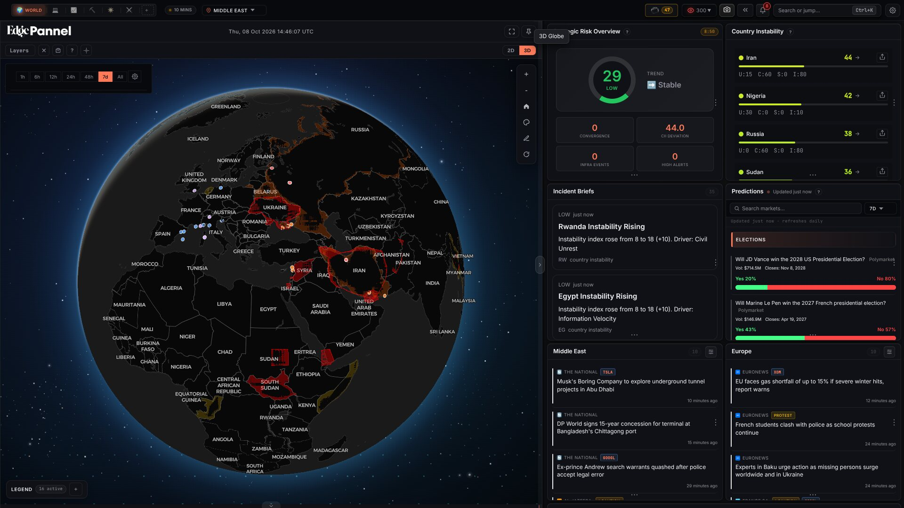</td>
    <td width="50%">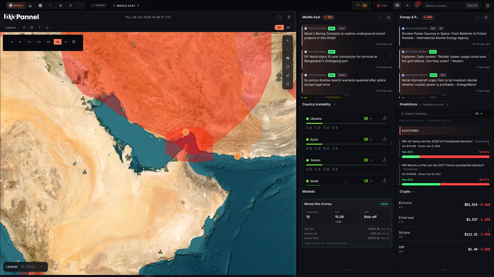</td>
  </tr>
  <tr>
    <td><b>3D globe.</b> Spin the planet with every layer still live. The Strategic Risk gauge and Country Instability scores sit alongside.</td>
    <td><b>Satellite imagery.</b> Switch to real imagery for physical context. Here: the Strait of Hormuz with conflict zones, strategic waterways and bases.</td>
  </tr>
  <tr>
    <td width="50%">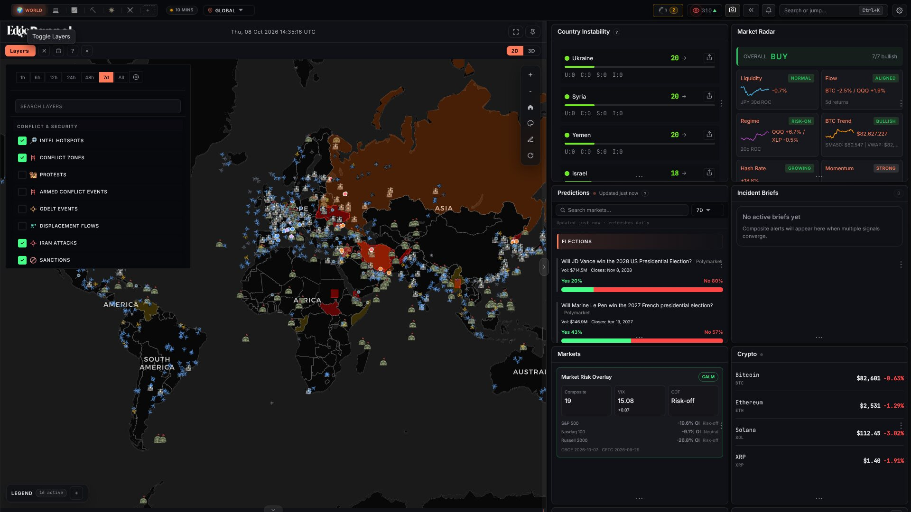</td>
    <td width="50%">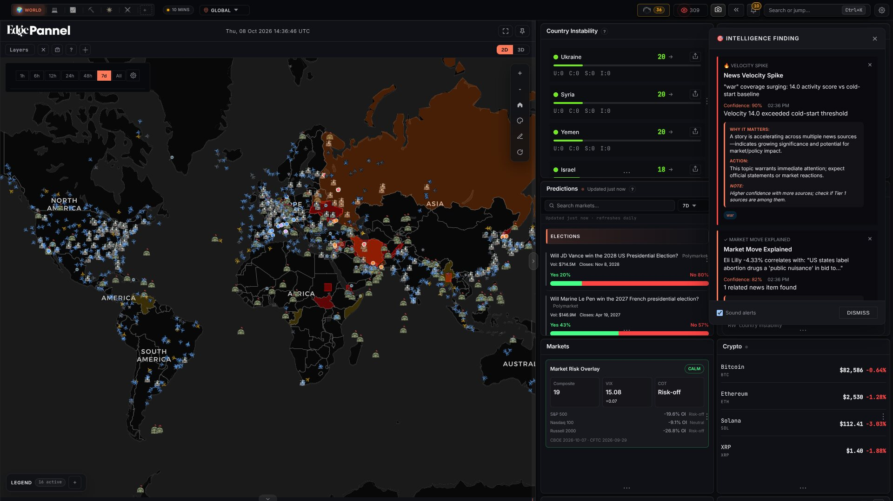</td>
  </tr>
  <tr>
    <td><b>64 layers, one click each.</b> Conflict, military, cyber, aviation, maritime, space, economy, environment, governance, tech and commodities.</td>
    <td><b>It tells you when something moves.</b> Velocity spikes, explained market moves and breaking alerts surface as intelligence findings, with confidence and "why it matters".</td>
  </tr>
</table>

### Six dashboards, one codebase

`SITE_VARIANT` is a build-time constant, so each dashboard ships only its own feeds, panels and layers. Same engine, completely different lens.

<table>
  <tr>
    <td width="50%">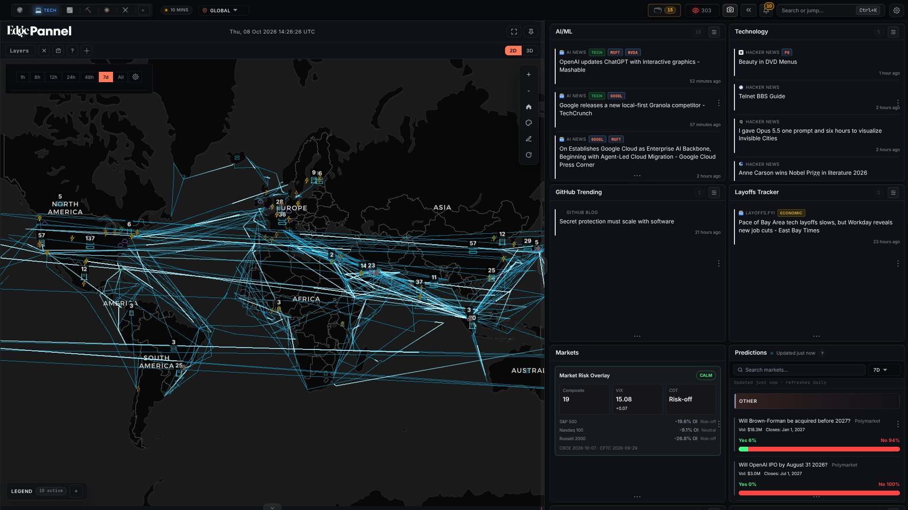</td>
    <td width="50%">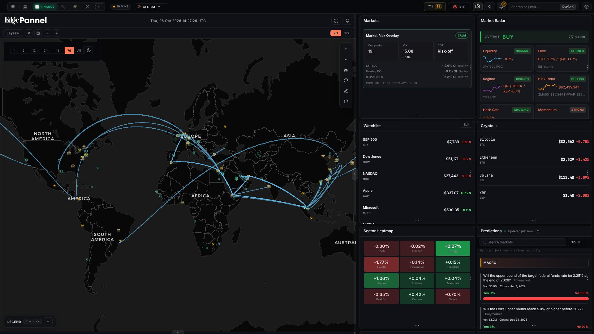</td>
  </tr>
  <tr>
    <td><b>Tech</b> · <code>tech.edgepannel.com</code><br>Submarine cables, datacenters, cloud regions and startup hubs, with AI/ML, GitHub trending and layoffs feeds.</td>
    <td><b>Finance</b> · <code>finance.edgepannel.com</code><br>Exchanges, central banks and trade routes, plus a sector heatmap, watchlist, crypto and macro radar.</td>
  </tr>
  <tr>
    <td width="50%">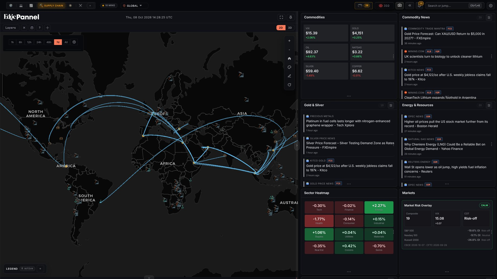</td>
    <td width="50%">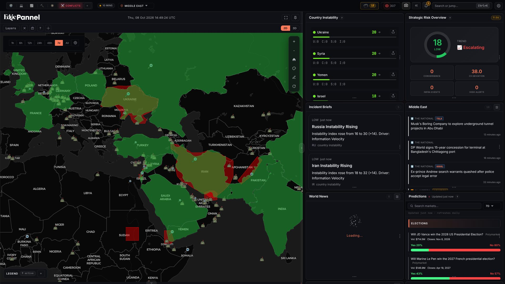</td>
  </tr>
  <tr>
    <td><b>Commodity</b> · <code>commodity.edgepannel.com</code><br>Mines, processing plants and commodity ports, with live VIX, oil, gold, silver, copper and natural gas.</td>
    <td><b>Conflicts</b> · <code>conflicts.edgepannel.com</code><br>A country-instability choropleth, strategic risk gauge, incident briefs and regional conflict feeds.</td>
  </tr>
  <tr>
    <td width="50%">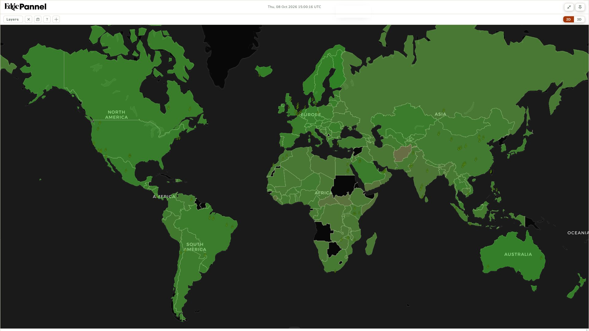</td>
    <td width="50%">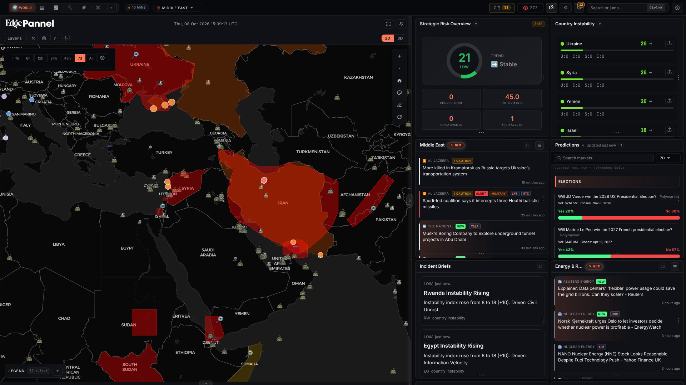</td>
  </tr>
  <tr>
    <td><b>Happy</b> · <code>happy.edgepannel.com</code><br>Good news only: a world-happiness choropleth, renewable installations, conservation wins and human progress.</td>
    <td><b>World</b> · <code>edgepannel.com</code><br>The flagship: geopolitics, military, infrastructure and markets in a single view.</td>
  </tr>
</table>

### Make it yours

Dark, light or follow-the-system themes, six accent colors, four interface fonts, a "terminal" text tone and five basemap styles. Every choice is remembered in the browser.

<table>
  <tr>
    <td width="50%">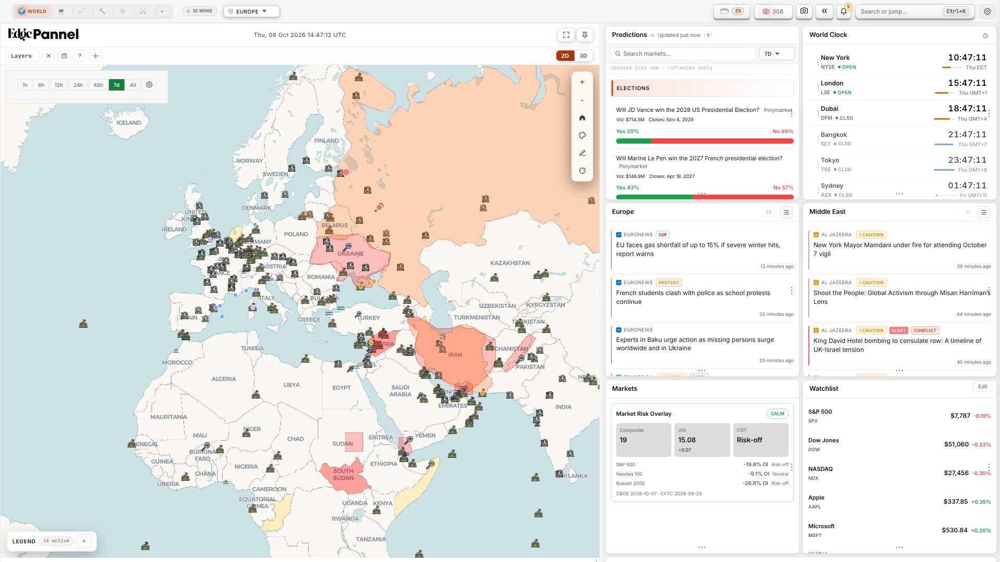</td>
    <td width="50%">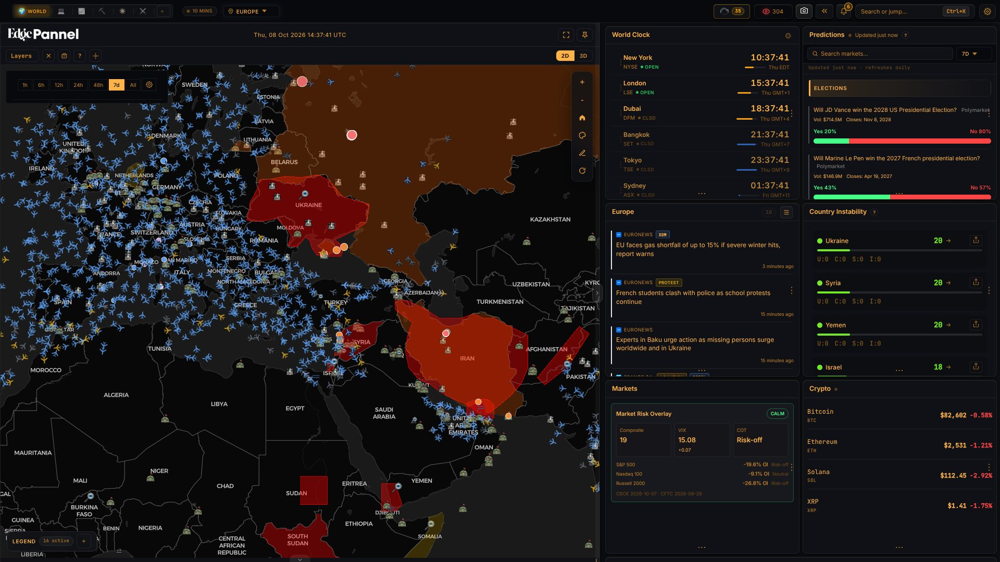</td>
  </tr>
  <tr>
    <td><b>Light theme + Ivory map.</b> Built for daylight offices and printed briefings.</td>
    <td><b>Terminal tone + Obsidian map + amber accent.</b> A trading-floor look with live flights over Europe.</td>
  </tr>
</table>

<p align="center">
  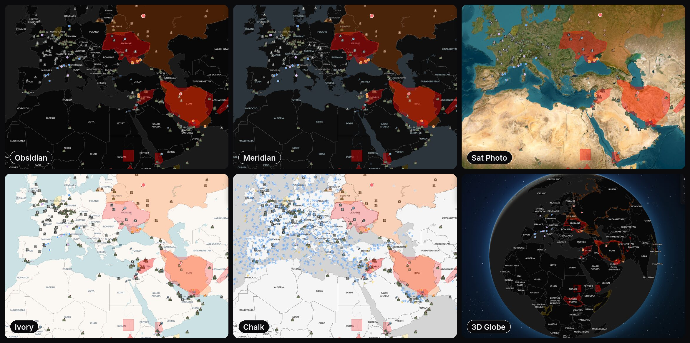
</p>

<p align="center"><sub>One view, five basemaps (Obsidian, Meridian, Sat Photo, Ivory, Chalk) plus the 3D globe. Basemap labels and borders are tuned per style so overlays stay legible.</sub></p>

### Find anything, tune everything

<table>
  <tr>
    <td width="50%">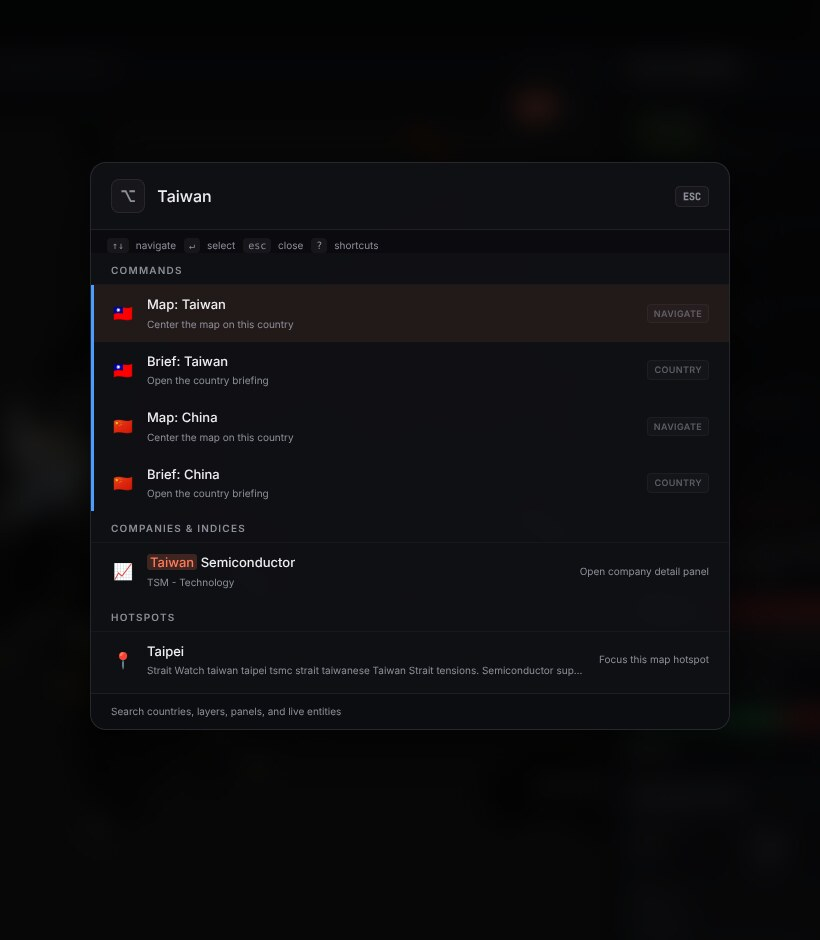</td>
    <td width="50%">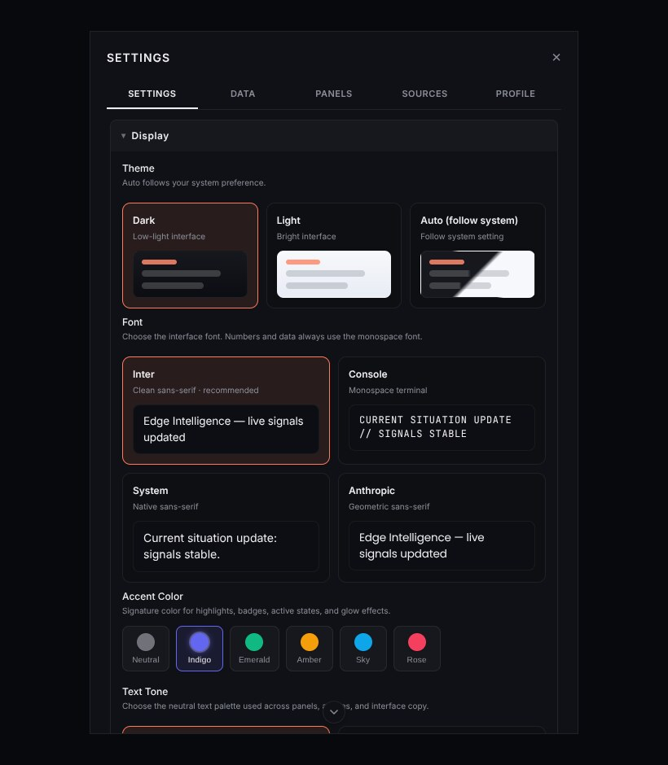</td>
  </tr>
  <tr>
    <td><b>⌘K / Ctrl+K command palette.</b> Fuzzy search across countries, briefs, companies, hotspots, layers and panel commands.</td>
    <td><b>Unified settings.</b> Theme, font, accent and text tone, plus data packs, panel visibility and custom RSS, Telegram and X sources.</td>
  </tr>
</table>

### Country intelligence dossiers

<p align="center">
  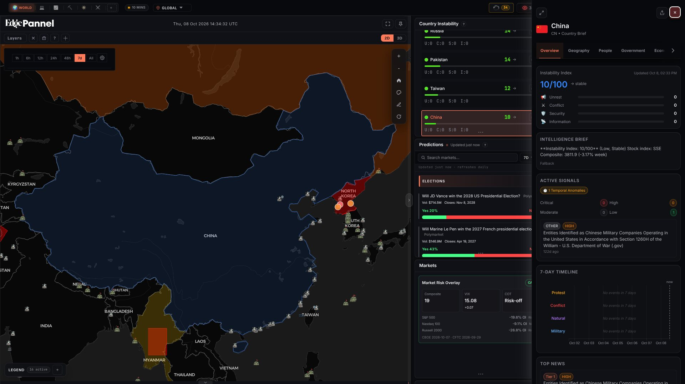
</p>

Pick any country to fly the map there and open a full dossier: Country Instability Index with its unrest, conflict, security and information components, an AI-written intelligence brief grounded in live headlines, active signals, a 7-day event timeline, plus geography, people, government and economy tabs.

### Quant tooling built in

<p align="center">
  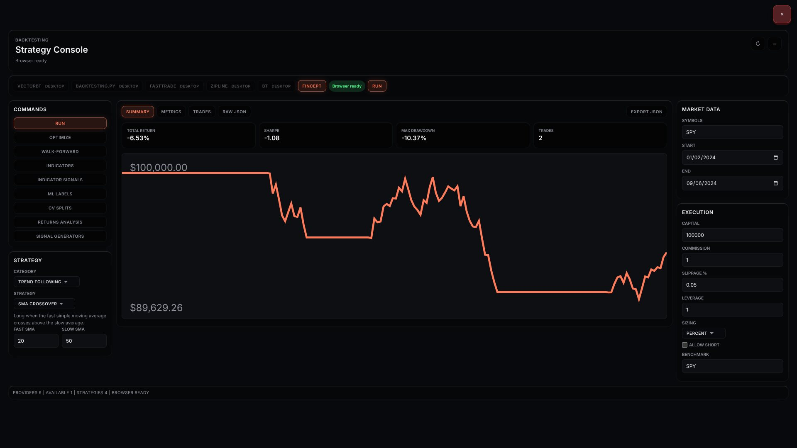
</p>

A browser-native **Strategy Console** runs backtests (SMA crossover on SPY shown above) with summary, metrics, trades and raw JSON. The desktop app adds VectorBT, Backtesting.py, FastTrade, Zipline and BT providers. A visual **Node Editor** chains triggers, market data and analytics into automated workflows.

### On the go

<p align="center">
  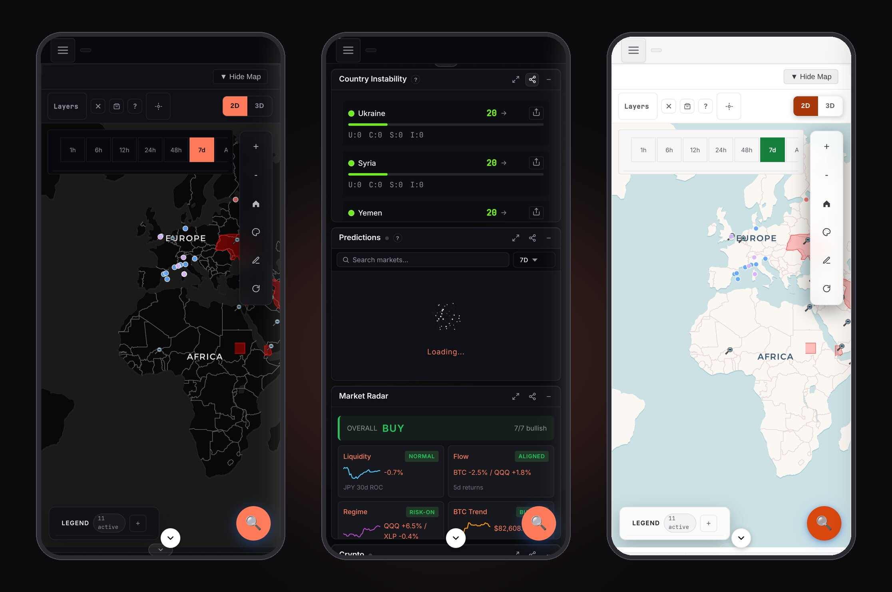
</p>

A touch-first layout with inertial pan, pinch-to-zoom, bottom-sheet popups, GPS centering and a collapsible map that turns the dashboard into a scrollable feed.

### And a front door to match

<p align="center">
  <a href="https://edgepannel.com">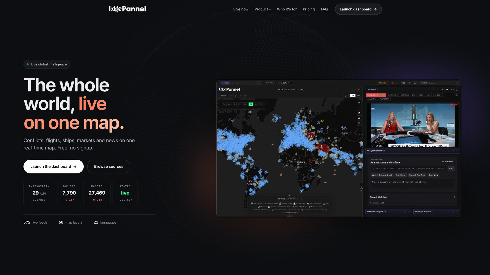</a>
</p>

---

## Why EdgePannel?

| Problem | EdgePannel |
| --- | --- |
| News scattered across hundreds of sources | **One dashboard** with 570+ curated feeds, deduplicated and tier-ranked server-side |
| No geospatial context for events | **64 toggleable layers** on a unified flat + globe engine, plus CII and governance choropleths |
| Information overload | **AI-synthesized briefs**, focal-point detection and intelligence findings that explain what moved and why |
| Crypto and macro signal noise | **7-signal Market Radar** with a composite BUY / CASH verdict |
| Expensive OSINT tools | **Free core:** the full map, feeds and layers need no account |
| Static news feeds | **Real-time updates** with 30+ live video streams, desktop push alerts and keyword monitors |
| Cloud-dependent AI | **Run AI locally** with Ollama or LM Studio. No API keys, nothing leaves your machine |
| Web-only dashboards | **Native desktop app** (Tauri) for macOS, Windows and Linux, plus an installable PWA with offline maps |
| English-only OSINT | **21 languages** with native-language feeds, AI-translated summaries and RTL support |
| Fragile, undocumented APIs | **Proto-first contracts:** 28 typed services with generated clients, servers and OpenAPI docs |
| Fixed feature set | **Marketplace and Workspaces:** install community layers, panels and sources; save named layouts |

---

## Features

<details open>
<summary><b>Maps and visualization</b></summary>

- **Unified map engine:** MapLibre GL + deck.gl render both the flat map and a native globe projection from one WebGL layer stack, switchable at runtime
- **64 toggleable layers** across 12 categories: conflict, military, cyber, aviation, space, economy, environment, governance, technology, urban, positive signals and commodities
- **Five basemap styles:** Obsidian, Meridian, Ivory, Chalk and Sat Photo, with self-hosted PMTiles support
- **Draw and measure toolkit:** native drawing, distance and area measurement, and annotations on the map
- **CII and governance choropleths** on the same engine
- **URL state sharing:** center, zoom, active layers and time range are encoded in shareable links
- **Workspaces:** save, name and switch between full dashboard layouts

</details>

<details>
<summary><b>AI and intelligence</b></summary>

- **World Brief:** an LLM-synthesized summary with a 4-tier fallback: Ollama / LM Studio (local) → Groq → OpenRouter → browser T5
- **Situation Report:** a full structured intelligence brief generated on demand
- **Map Copilot:** an agent chat that can highlight features, read the visible region and change the time range on the live map
- **AI Deduction and Forecasting:** free-text geopolitical analysis grounded in live headlines
- **Headline Memory (RAG):** an opt-in, browser-local semantic index using ONNX embeddings in IndexedDB
- **Threat classification:** an instant keyword classifier with async ML and LLM override
- **Country dossiers:** CII scores, AI analysis, timelines, factbook data and prediction markets, with maximize mode and native share
- **Analyst Workbench:** a terminal-style command surface (`watch Taiwan Strait`, `brief Iran 24h`, `export Red Sea`)

</details>

<details>
<summary><b>Scoring and detection</b></summary>

- **Country Instability Index (CII):** real-time stability scores from a weighted multi-signal blend for tier-1 nations, plus universal scoring for every country
- **Hotspot Escalation:** dynamic scoring that blends news activity, CII, geo-convergence and military signals
- **Strategic Risk Score:** composite risk from convergence, CII, infrastructure, theater posture and breaking news
- **Signal aggregation:** multi-source fusion with temporal-baseline anomaly detection (Welford's online algorithm)
- **UCDP conflict data** for historical and ongoing armed-conflict events
- **GPS / GNSS jamming detection:** an H3 hexagonal-grid interference overlay wired into CII scoring
- **Geofenced alert rules:** user-defined, editable rules with a Sources and Status health panel

</details>

<details>
<summary><b>Live news, signals and video</b></summary>

- **570+ RSS feeds** across geopolitics, defense, energy, tech and finance
- **Telegram Intel:** curated OSINT channels relayed via MTProto
- **OREF Israel Sirens:** a real-time alert relay with Hebrew → English translation
- **Security advisories:** aggregated government travel and security alerts
- **Aviation:** global airport delays, NOTAM closure detection and live ADS-B flight tracking
- **Maritime:** AIS vessel tracking and a Strait of Hormuz transit tracker
- **Article reader:** full-text extraction with readability parsing and reading progress
- **30+ live video streams:** Bloomberg, Sky News, Al Jazeera, DW, France 24 and more, with native HLS
- **Keyword monitors:** word-boundary matching, auto-coloring and desktop push notifications
- **Breaking-news banner** with audio alerts for critical and high-severity items

</details>

<details>
<summary><b>Markets and quant</b></summary>

- **Market Radar:** liquidity, flow, regime, BTC trend, hash rate and momentum rolled into one verdict
- **Markets, watchlist, sector heatmap, crypto, commodities, FX, bonds and Fear and Greed**
- **Prediction markets:** live Polymarket odds with volume and close dates
- **Calendars:** economic, earnings and IPO calendars, insider trading and public filings
- **Portfolio, backtesting and algo trading panels,** plus a visual Node Editor for workflows

</details>

<details>
<summary><b>Desktop, mobile and platform</b></summary>

- **Native desktop app** (Tauri 2) with OS keychain, a local Rust sidecar and cloud fallback
- **Progressive Web App:** installable, with offline map support
- **Mobile-optimized map:** inertial touch pan, pinch-to-zoom, bottom-sheet popups and GPS centering
- **Desktop push notifications** for critical signals
- **Responsive layout:** an ultra-wide L-shaped layout on 2000px+ screens and collapsible panels
- **21 languages:** lazy-loaded bundles, native-language feeds, AI translation and RTL support
- **Marketplace:** community map layers, panels and custom RSS, Telegram and X sources
- **What's New panel:** a release timeline parsed from `CHANGELOG.md` at build time
- **Story sharing** to X, LinkedIn, WhatsApp, Telegram and Reddit

</details>

---

## Architecture

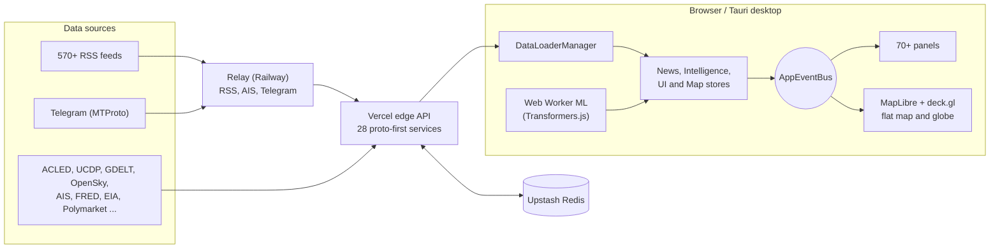
```mermaid
flowchart LR
  subgraph Sources["Data sources"]
    RSS["570+ RSS feeds"]
    APIS["ACLED, UCDP, GDELT, OpenSky,<br/>AIS, FRED, EIA, Polymarket ..."]
    TG["Telegram (MTProto)"]
  end

  Relay["Relay (Railway)<br/>RSS, AIS, Telegram"]
  Edge["Vercel edge API<br/>28 proto-first services"]
  Cache[("Upstash Redis")]

  subgraph Client["Browser / Tauri desktop"]
    DL["DataLoaderManager"] --> Stores["News, Intelligence,<br/>UI and Map stores"]
    ML["Web Worker ML<br/>(Transformers.js)"] --> Stores
    Stores --> Bus(("AppEventBus"))
    Bus --> Panels["70+ panels"]
    Bus --> Map["MapLibre + deck.gl<br/>flat map and globe"]
  end

  RSS --> Relay
  TG --> Relay
  Relay --> Edge
  APIS --> Edge
  Edge <--> Cache
  Edge --> DL
```

The codebase uses a **modular manager architecture** with clear ownership boundaries:

```text
src/app/
  event-bus.ts                 Lightweight pub/sub for cross-module communication
  stores/
    news-store.ts              Encapsulated news state (allNews, byCategory, happy)
    intelligence-store.ts      Markets, predictions, clusters, cyber threats
    ui-store.ts                Panel settings, map layers, time range, idle state
    map-store.ts               Map container reference, initial URL state
  panel-interfaces.ts          Interface contracts replacing 56+ type-casts
  news-clustering-pipeline.ts  News loading, clustering, categorization
  signal-publisher.ts          Supplemental bus, CII refresh, intelligence signals
  data-renderer.ts             Panel rendering via interface-based dispatch
  data-loader.ts               Fetch orchestration, circuit breakers, staleness
  country-intel.ts             Country brief management
  search-manager.ts            Cmd+K search index
  refresh-scheduler.ts         Smart polling with exponential backoff
```

**Key patterns**

- **Event bus:** modules communicate through `AppEventBus` instead of direct mutation
- **Owned stores:** each domain (news, intelligence, UI, map) has a single writer
- **Panel interfaces:** 16 renderable interfaces replace string-key and type-cast lookups
- **ManagedService:** singleton services implement an `init()` / `destroy()` lifecycle via a registry
- **Variant tree-shaking:** `SITE_VARIANT` is a build-time constant, so dead variant code is eliminated

**Data flow:** `DataLoaderManager` runs parallel fetches across domain services, `NewsClusteringPipeline` handles Jaccard clustering and categorization, `SignalPublisher` refreshes CII and intelligence aggregation, and `DataRenderer` dispatches to panels by interface. Stores emit events on change and subscribers react automatically.

### Variant matrix

| Dashboard | Focus | Feeds | Default panels | Desktop app |
| --- | --- | --- | --- | --- |
| **[World](https://edgepannel.com)** | Geopolitics, military, conflicts, infrastructure | 30 categories, 250+ | 64 | Yes |
| **[Tech](https://tech.edgepannel.com)** | AI/ML, startups, cybersecurity | 21 categories, 150+ | 31 | Yes |
| **[Finance](https://finance.edgepannel.com)** | Markets, trading, central banks | 15 categories, 65+ | 45 | Yes |
| **[Commodity](https://commodity.edgepannel.com)** | Mining, metals, energy, critical minerals | 10 categories, 60+ | 26 | Web only |
| **[Happy](https://happy.edgepannel.com)** | Good news, conservation, human progress | 6 categories, 28+ | 10 | Web only |
| **[Conflicts](https://conflicts.edgepannel.com)** | Conflict, military, displacement, security risk | 8 categories, 75+ | 28 | Yes |

---

## Programmatic API

Every data endpoint is available at `api.edgepannel.com`:

```bash
# Market quotes
curl -s 'https://api.edgepannel.com/api/market/v1/list-market-quotes?symbols=AAPL,MSFT,GOOGL'

# Airport delays
curl -s 'https://api.edgepannel.com/api/aviation/v1/list-airport-delays'

# Earthquakes
curl -s 'https://api.edgepannel.com/api/seismology/v1/list-earthquakes'

# Company enrichment
curl -s 'https://api.edgepannel.com/api/enrichment/company?domain=stripe.com'
```

All 28 service domains (alerts, aviation, climate, conflict, consumer-prices, core, cyber, displacement, economic, forecast, giving, infrastructure, intelligence, maritime, market, military, natural, news, positive-events, prediction, reference, research, resilience, seismology, supply-chain, trade, unrest and wildfire) are exposed as `POST /api/{domain}/v1/{rpc-name}`. Read-only RPCs also accept GET with query params.

> **Note:** use `api.edgepannel.com`, not `edgepannel.com`. The main domain requires browser origin headers.

---

## Quick start

For authorised developers and deployments only. The source is proprietary and running it requires a written agreement (see [`LICENSE`](./LICENSE)).

```bash
git clone https://github.com/semirkabir/EdgePannel.git
cd EdgePannel
npm install
npm run dev       # Vite dev server + RSS/AIS relay on http://localhost:3000
```

Run `npm run dev:tech`, `dev:finance`, `dev:happy`, `dev:commodity` or `dev:conflicts` for the other dashboards.

### Environment variables (optional)

```bash
cp .env.example .env.local
```

The dashboard runs with zero configuration: static layers, the map and browser-side ML all work without API keys. `.env.example` documents 60+ optional integrations; the main groups are:

| Group | Variables | Free tier |
| --- | --- | --- |
| **AI (local)** | `OLLAMA_API_URL`, `OLLAMA_MODEL` | Free (your hardware) |
| **AI (cloud)** | `GROQ_API_KEY`, `OPENROUTER_API_KEY` | 14,400 req/day (Groq) |
| **Cache** | `UPSTASH_REDIS_REST_URL`, `UPSTASH_REDIS_REST_TOKEN` | 10K commands/day |
| **Markets** | `FINNHUB_API_KEY`, `FRED_API_KEY`, `EIA_API_KEY` | All free tier |
| **Aviation / maritime** | `AVIATIONSTACK_API`, `WINGBITS_API_KEY`, `AISSTREAM_API_KEY` | Free tier available |
| **Conflict / cyber** | `ACLED_ACCESS_TOKEN`, `UCDP_ACCESS_TOKEN`, `OTX_API_KEY`, `ABUSEIPDB_API_KEY` | Free tier available |
| **Telegram intel** | `TELEGRAM_API_ID`, `TELEGRAM_API_HASH`, `TELEGRAM_SESSION` | Free (MTProto) |
| **UI** | `VITE_VARIANT` | N/A |

### Deployment

| Option | Command | What you get |
| --- | --- | --- |
| **Vercel** (recommended) | `vercel` | Production deployment with edge functions |
| **Local development** | `npm run dev` | Frontend + RSS/AIS relay on localhost:3000 |
| **Edge parity** | `vercel dev` | Frontend + all Vercel edge functions locally |

The RSS/AIS relay (`scripts/ais-relay.cjs`) is designed to run standalone (for example on Railway, see `railpack.json`) alongside the Vercel deployment.

<details>
<summary><b>All development commands</b></summary>

```bash
# Development
npm run dev              # World dashboard (edgepannel.com)
npm run dev:tech         # Tech
npm run dev:finance      # Finance
npm run dev:commodity    # Commodity
npm run dev:happy        # Happy
npm run dev:conflicts    # Conflicts
npm run desktop:dev      # Tauri desktop app

# Production builds
npm run build:full       # or build:tech, build:finance, build:commodity, build:happy, build:conflicts
npm run build:desktop    # Full build with Rust sidecar

# Quality
npm run typecheck:all    # Frontend + API TypeScript
npm run test:e2e         # Playwright e2e, all variants
npm run test:e2e:visual  # Visual regression
npm run test:sidecar     # Sidecar / API unit tests

# Protobuf
make generate            # Generate TS clients/servers + OpenAPI from .proto
make check               # Lint + generate

# Desktop packaging
npm run desktop:package:macos:full
npm run desktop:package:windows:full
```

</details>

---

## Tech stack

| Category | Technologies |
| --- | --- |
| **Frontend** | Preact 10, TypeScript 5.7, Vite 8 |
| **Maps** | MapLibre GL 5 (native globe projection) + deck.gl 9: one engine for flat map and globe |
| **Charts** | D3 (per-module `d3-*` imports), lightweight-charts |
| **Desktop** | Tauri 2 (Rust sidecar), OS keychain, local API server |
| **Realtime data** | Convex |
| **AI / ML** | Ollama, LM Studio, Groq, OpenRouter, Transformers.js (browser), ONNX Runtime Web |
| **APIs** | Protobuf (sebuf codegen): 168 proto files, 28 services |
| **Testing** | Playwright (e2e + visual regression), Node test runner (unit) |
| **i18n** | i18next (21 languages) |
| **Analytics** | Sentry, Vercel Analytics |

---

## Roadmap

- [ ] Self-hosted Docker image

---

## License

**Proprietary, all rights reserved.** See [`LICENSE`](./LICENSE).

This software is not open source. No right to use, copy, modify or distribute the source is granted except under a written agreement with the copyright holder. Access to the hosted service is governed by the [Terms of Service](https://edgepannel.com/terms), which do not grant any rights to the source code.

| Use case | Allowed? |
| --- | --- |
| Using the hosted service | Yes, under the Terms of Service |
| Reading, copying or self-hosting the source | No, written agreement required |
| Forking or modifying | No, written agreement required |
| Redistributing, in whole or in part | No |

Third-party open-source components remain under their own licences, and third-party data providers' terms of use apply independently.

Copyright (C) 2026 Semir Kabir. All rights reserved.
Portions copyright (C) 2024-2026 Elie Habib, incorporated under a separate commercial licence.

---

## Credits

EdgePannel builds on **World Monitor** by **Elie Habib** ([GitHub](https://github.com/koala73)), incorporated under a separate commercial licence.

<a href="https://github.com/koala73/worldmonitor/graphs/contributors">
  
</a>

### Security acknowledgments

We thank the following researchers for responsibly disclosing security issues:

- **Cody Richard:** disclosed three findings covering IPC command exposure via DevTools in production builds, renderer-to-sidecar trust boundary analysis, and the global fetch patch credential injection architecture (2026)

---

<p align="center">
  <a href="https://edgepannel.com"><b>edgepannel.com</b></a>
</p>
